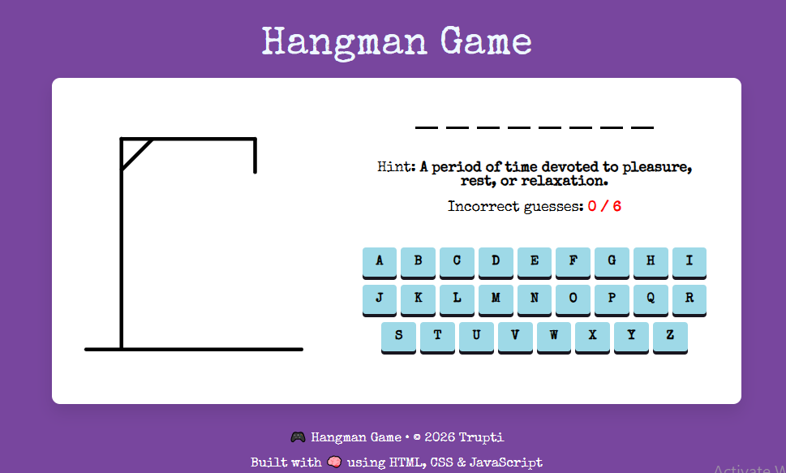

# 🎮 Hangman Game

***Hangman Game*** is a browser-based puzzle game built with **HTML, CSS, and JavaScript**.  
Your mission: guess the hidden word before the hangman figure is fully drawn!

---

## Features
- **Dynamic Word List -** Multiple categories of words with helpful hints.

- **Visual Feedback -** Hangman stages (SVG) progress with each wrong guess.

- **Responsive Design -** Works smoothly on desktop and mobile devices.

- **Keyboard Effect -** Mechanical keyboard effects for an engaging experience.

---

## 🚀 Getting Started
1. Clone or download this repository.
2. Ensure you have the images/ folder containing the required .svg and .gif files.
3. Open `index.html` in your browser to start playing.

---

## 📂 Project Structure
```text
Hangman/
│
├── images/           # Contains hangman-0 to 6.svg, victory.gif, lost.gif
├── index.html        # Main game structure
├── Style.css         # Responsive styling and animations
├── Script.js         # Core game logic
├── word-list.js      # External file for word and hint management
└── README.md         # Documentation
```

---

## 🖼️ Screenshots


---

## 🛠 Tech Stack
<div style="display: flex; flex-wrap: wrap; gap: 8px;">
  
  
  
  
  
  
  
</div>

---

## 📌 Future Enhancements
- Add **timer and scoring system**
- **Sound effects and background music**
- Save **progress across sessions**
- Local storage to keep **Score track** of your Wins and Losses.
- Adjustable **Difficulty Levels** with timer-based challenges.
- Allow users to choose word categories (e.g., Science, Sports, Tech).
- Toggle **Dark/Light themes** for better visual comfort.
  
---

## 🤝 Contributing
Pull requests are welcome!  
For major changes, please open an issue first to discuss what you’d like to improve.  

---

## 🧑‍💻 Author
    Auther Name:     Trupti Y. Sabale  
    Created:         01-Jul-2026
    Updated:         01-Jul-2026

---

## 📜 License
This project is for personal/educational use only.
