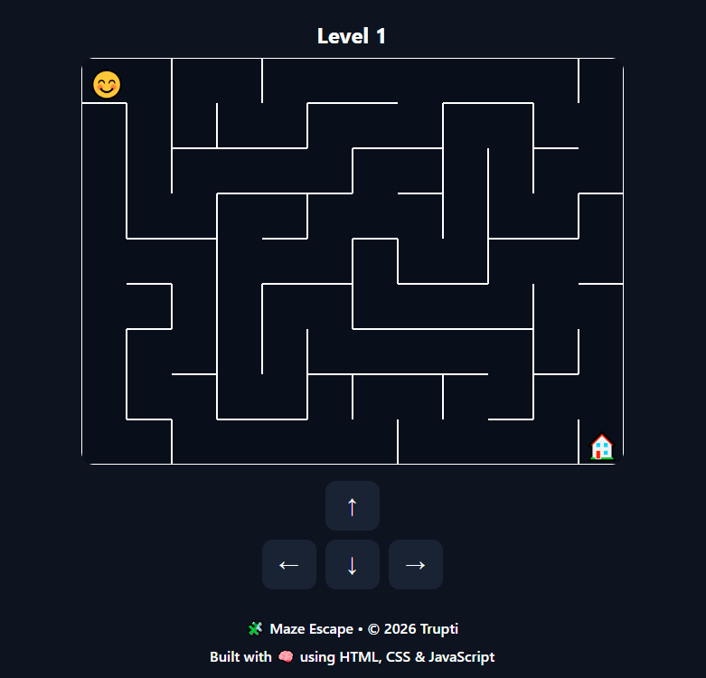

# 🧩 Maze Escape

Maze Escape is a browser-based puzzle game built with **HTML, CSS, and JavaScript**.  
Your mission: guide the player 😊 through a procedurally generated maze and reach the 🏠 house.  
Each level gets progressively larger and more challenging, testing your logic and patience.

---

## 🎮 Features
- **Keyboard controls** (⬅️ ⬆️ ⬇️ ➡️) for smooth movement.
- **On-screen buttons** for mobile/touch users.
- **Procedural maze generation** using Depth-First Search (DFS).
- **Extra paths/loops** for multiple solutions.
- **Level progression** with increasing difficulty.
- **Overlay feedback** when a level is completed.

---

## 🚀 Getting Started
1. Clone or download this repository.
2. Open `index.html` in your browser.
3. Press **Start Game** and begin your maze adventure!

---

## 📂 Project Structure
```text
MazeGame/
│
├── index.html       # Main game page
│── Style.css        # Game styling
│── Script.js        # Game logic (maze generation, movement, levels)
│── README.md        # Documentation
```
---

## 🖼️ Screenshots


---

## 🛠 Tech Stack
<div style="display: flex; flex-wrap: wrap; gap: 8px;">
  
  
  
  
  
  
  
</div>

---

## 📌 Future Enhancements
- Add **timer and scoring system**
- Introduce **obstacles and collectibles**
- More **maze themes** (dark mode, neon, retro)
- **Sound effects and background music**
- Save **progress across sessions**

---

## 🤝 Contributing
Pull requests are welcome!  
For major changes, please open an issue first to discuss what you’d like to improve.  

---

## 🧑‍💻 Author
---
    Auther Name:     Trupti Y. Sabale  
    Created:         29-Jan-2026
    Updated:         -

---

## 📜 License
This project is for personal/educational use only.
