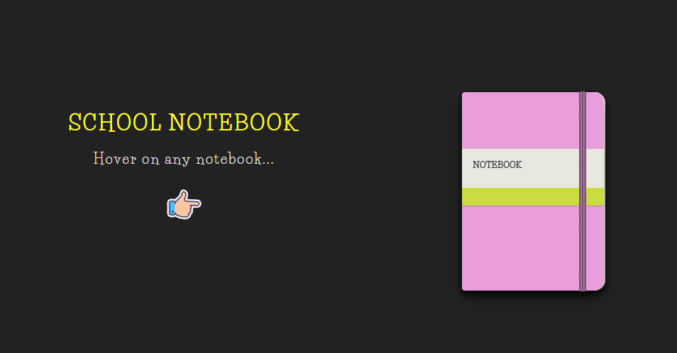

# 📖 Notebook Pages Flip

An interactive HTML + CSS project that simulates a **school notebook with multiple pages flipping open** when hovered.  
This project uses 3D transforms, sequential transitions, and creative layering to create a realistic page-flip effect.

---

## ✨ Features
- **Notebook Cover**
  - Plum-colored cover with gradient spine shading.  
  - Custom "NOTEBOOK" skin label with decorative strip.  

- **Page Flip Animation**
  - Pages flip sequentially on hover.  
  - Smooth 3D rotation (`rotateY`) with staggered delays for realism.  
  - Dotted page styling for notebook paper texture.  

- **Styling Details**
  - Fonts: *Life Savers* and *Pacifico*.  
  - Responsive flexbox layout with centered notebook.  
  - Hover-triggered animations for both cover and pages.  

---

## 📂 File Structure
```
Notebook-Pages-Flip/
│── index.html              # Main HTML structure
│── Notebook Page Flip.css  # Styling and animations
│── README.md               # Project documentation
```
---

## 🚀 Usage
1. Clone or download this repository.  
2. Open `index.html` in your browser.  
3. Hover over the notebook to see the cover flip open and pages turn sequentially.  

---

## 🌍 Accessibility
- Clear headings (`h1`) with descriptive labels.  
- Semantic structure with wrapper divs for notebook and pages.  

---

## 🖼️ Preview


---

## 🎨 Credits
- Inspired by CodePen: **Olivia Ng**  
- Icons: [Icons8 Doodle Books](https://icons8.com/icons/set/books)  
- Social icons: [Simple Line Icons](https://cdnjs.com/libraries/simple-line-icons)  

---

## 🛠 Tech Stack
<div style="display: flex; flex-wrap: wrap; gap: 8px;">
  
  
  
  
  
  
  
  
</div>
